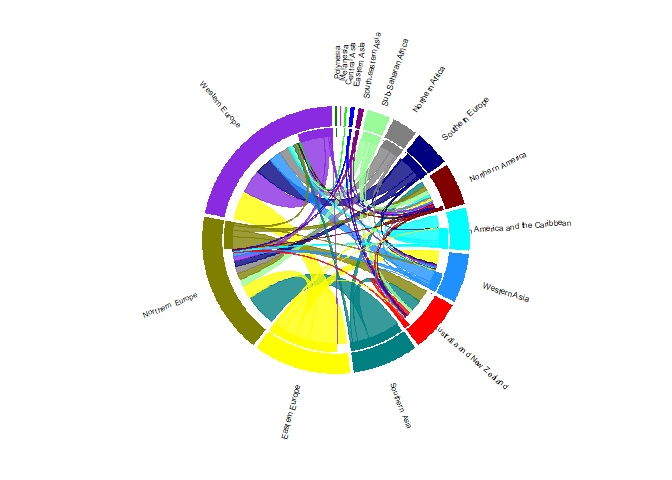

Healthcare Workers’ Interregional Migration
================
Ruri Proto
31/05/2021

## **Research Questions**

-   To which geographical regions do healthcare workers migrate?

-   From which geographical regions do healthcare workers emigrate?

-   Are there any preferences, such that healthcare workers from a given
    region are more likely to emigrate to another specific region?

## **Data Origin**

I retrieved data from the [OECD
website](https://stats.oecd.org/Index.aspx?DataSetCode=HEALTH_WFMI),
where I downloaded migration information from all OECD countries in
2018. This refers to the number of healthcare workers (doctors and
nurses) who are registered or in the process to gain registration to
practise in a country other than the one in which they have obtained
their medical education qualifications.

I subsequently retrieved a dataset linking countries with grographical
subregions from
[github](https://github.com/lukes/ISO-3166-Countries-with-Regional-Codes/blob/master/all/all.csv).

``` r
library(readr)
library(here)

wf_mig = read_csv(here("data-raw/workforce-migration.csv")) #migration data
sub_reg = read_csv(here("data-raw/subregions.csv")) #subregions data
```

``` r
head(wf_mig)
```

    ## # A tibble: 6 x 4
    ##   Country     `Country of origin`  Year Value
    ##   <chr>       <chr>               <dbl> <dbl>
    ## 1 Canada      Afghanistan          2018     5
    ## 2 France      Afghanistan          2018    12
    ## 3 Germany     Afghanistan          2018   153
    ## 4 New Zealand Afghanistan          2018     0
    ## 5 Norway      Afghanistan          2018    22
    ## 6 Switzerland Afghanistan          2018     6

``` r
head(sub_reg)
```

    ## # A tibble: 6 x 11
    ##   name      `alpha-2` `alpha-3` `country-code` `iso_3166-2` region `sub-region` 
    ##   <chr>     <chr>     <chr>     <chr>          <chr>        <chr>  <chr>        
    ## 1 Afghanis~ AF        AFG       004            ISO 3166-2:~ Asia   Southern Asia
    ## 2 Åland Is~ AX        ALA       248            ISO 3166-2:~ Europe Northern Eur~
    ## 3 Albania   AL        ALB       008            ISO 3166-2:~ Europe Southern Eur~
    ## 4 Algeria   DZ        DZA       012            ISO 3166-2:~ Africa Northern Afr~
    ## 5 American~ AS        ASM       016            ISO 3166-2:~ Ocean~ Polynesia    
    ## 6 Andorra   AD        AND       020            ISO 3166-2:~ Europe Southern Eur~
    ## # ... with 4 more variables: intermediate-region <chr>, region-code <chr>,
    ## #   sub-region-code <chr>, intermediate-region-code <chr>

## **Data Processing**

Data processing was long and tedious, hence difficult to present here.
However, interested readers should check the relevant
[script](https://github.com/protor23/healthcare-workers-migration/blob/main/scripts/01_data-processing.R),
but examples are provided here.

It included:

-   eliminating irrelevant rows and columns and renaming columns

``` r
library(dplyr)

wf_mig = wf_mig[, -3] #eliminate year column
colnames(wf_mig) = c("to", "from", "number") #rename columns

wf_mig = wf_mig %>%
  filter(to != from) %>%
  filter(number != 0) #remove domestic migration cases and cases with 0 migrants
```

-   (unfortunately) hardcoding

I discovered wf\_mig and sub\_reg had different names for the same
countries, or some countries in wf\_mig were not featured in sub\_reg.
There few instances of these issues, so I replaced the missing data
easily after extensive geopolitical googling!

``` r
for(i in 1:length(missing_countries)) { #for every missing country
  for (j in 1:length(unique(sub_reg)$country)) #check all unique countries in sub_reg
    if(str_detect(unique(sub_reg)$country[j], missing_countries[i])) { #find similarities
      print(c(unique(sub_reg)$country[j], missing_countries[i])) #print similarities
    }
}
```

    ## [1] "Bolivia (Plurinational State of)" "Bolivia"                         
    ## [1] "North Macedonia" "Macedonia"      
    ## [1] "Moldova, Republic of" "Moldova"             
    ## [1] "United Kingdom of Great Britain and Northern Ireland"
    ## [2] "United Kingdom"                                      
    ## [1] "Czechia" "Czech"  
    ## [1] "Iran (Islamic Republic of)" "Iran"                      
    ## [1] "Slovakia" "Slovak"  
    ## [1] "Syrian Arab Republic" "Syria"               
    ## [1] "Tanzania, United Republic of" "Tanzania"                    
    ## [1] "Venezuela (Bolivarian Republic of)" "Venezuela"                         
    ## [1] "Korea (Democratic People's Republic of)"
    ## [2] "Korea"                                  
    ## [1] "Korea, Republic of" "Korea"             
    ## [1] "Congo" "Congo"
    ## [1] "Congo, Democratic Republic of the" "Congo"                            
    ## [1] "United States of America" "United States"           
    ## [1] "United States Minor Outlying Islands"
    ## [2] "United States"

-   joining data sets

I allocated subregions to both countries of origin and destination
countries.

``` r
data = left_join(wf_mig, sub_reg, by = c("to" = "country_join"))

data = rename(data, subregion_to =  subregion)

data = left_join(data, sub_reg, by = c("from" = "country_join"))

data = rename(data, subregion_from = subregion
```

The final dataset had no missing values:

``` r
head(data)
```

    ## # A tibble: 6 x 5
    ##   to             from        number subregion_to     subregion_from
    ##   <chr>          <chr>        <dbl> <chr>            <chr>         
    ## 1 Canada         Afghanistan      5 Northern America Southern Asia 
    ## 2 France         Afghanistan     12 Western Europe   Southern Asia 
    ## 3 Germany        Afghanistan    153 Western Europe   Southern Asia 
    ## 4 Norway         Afghanistan     22 Northern Europe  Southern Asia 
    ## 5 Switzerland    Afghanistan      6 Western Europe   Southern Asia 
    ## 6 United Kingdom Afghanistan     53 Northern Europe  Southern Asia

``` r
sapply(data, 
       function(x) sum(is.na(x))
)
```

    ##             to           from         number   subregion_to subregion_from 
    ##              0              0              0              0              0

## **Intermediate data transformations**

The visualization I have planned requires two objects, a matrix showing
the number of migrants for all combinations of subregions, and a data
frame showing assigning plotting details (e.g., colours) to each
individual subregion. The code for this work is presented
[here](https://github.com/protor23/healthcare-workers-migration/blob/main/scripts/02_visualization-matrices.R).

At the end, the two objects looked like this:

``` r
head(flow_matrix)
```

    ##                    Polynesia Melanesia Central Asia Eastern Asia
    ## Polynesia                  0         0            0            0
    ## Melanesia                  0         0            0            0
    ## Central Asia               0         0            0            0
    ## Eastern Asia               0         0            0            0
    ## South-eastern Asia         0         0            0            0
    ## Sub-Saharan Africa         0         0            0            0
    ##                    South-eastern Asia Sub-Saharan Africa Northern Africa
    ## Polynesia                           0                  0               0
    ## Melanesia                           0                  0               0
    ## Central Asia                        0                  0               0
    ## Eastern Asia                        0                  0               0
    ## South-eastern Asia                  0                  0               0
    ## Sub-Saharan Africa                  0                  0               0
    ##                    Southern Europe Northern America
    ## Polynesia                        0                1
    ## Melanesia                        0                4
    ## Central Asia                     2               26
    ## Eastern Asia                     0              527
    ## South-eastern Asia               0              488
    ## Sub-Saharan Africa               0             3849
    ##                    Latin America and the Caribbean Western Asia
    ## Polynesia                                        0            0
    ## Melanesia                                        0            0
    ## Central Asia                                     2           69
    ## Eastern Asia                                     1            0
    ## South-eastern Asia                               1            2
    ## Sub-Saharan Africa                               1          125
    ##                    Australia and New Zealand Southern Asia Eastern Europe
    ## Polynesia                                  1             0              0
    ## Melanesia                                 67             0              0
    ## Central Asia                               3             0             95
    ## Eastern Asia                             756             0             32
    ## South-eastern Asia                      1086             0              4
    ## Sub-Saharan Africa                      2828             0              2
    ##                    Northern Europe Western Europe
    ## Polynesia                        1              0
    ## Melanesia                        5              1
    ## Central Asia                    95            442
    ## Eastern Asia                   336            539
    ## South-eastern Asia             819            571
    ## Sub-Saharan Africa            5931           2112

``` r
head(subregion_details)
```

    ##            subregion outer inner total         rgb   r   g   b    rcol
    ## 1          Polynesia     3     0     3     0,128,0   0 128   0 #008000
    ## 2          Melanesia    77     0    77   255,0,255 255   0 255 #FF00FF
    ## 3       Central Asia   734     0   734     0,255,0   0 255   0 #00FF00
    ## 4       Eastern Asia  2191     0  2191     0,0,255   0   0 255 #0000FF
    ## 5 South-eastern Asia  2971     0  2971   128,0,128 128   0 128 #800080
    ## 6 Sub-Saharan Africa 14848     0 14848 152,251,152 152 251 152 #98FB98
    ##        lcol xmin order
    ## 1 #008000C8    0     1
    ## 2 #FF00FFC8    0     2
    ## 3 #00FF00C8    0     3
    ## 4 #0000FFC8    0     4
    ## 5 #800080C8    0     5
    ## 6 #98FB98C8    0     6

## **Data visualization**

Note I have adjusted text parameters to look good here.

``` r
library(circlize)
```

    ## ========================================
    ## circlize version 0.4.12
    ## CRAN page: https://cran.r-project.org/package=circlize
    ## Github page: https://github.com/jokergoo/circlize
    ## Documentation: https://jokergoo.github.io/circlize_book/book/
    ## 
    ## If you use it in published research, please cite:
    ## Gu, Z. circlize implements and enhances circular visualization
    ##   in R. Bioinformatics 2014.
    ## 
    ## This message can be suppressed by:
    ##   suppressPackageStartupMessages(library(circlize))
    ## ========================================

``` r
circos.clear() #reset circular layout parameters

par(mar = rep(0 , 4)) #set margins to 0 
circos.par(cell.padding = c(0, 0, 0, 0), 
           track.margin = c(0, 0.1), 
           start.degree = 90, #start plotting at 12 o'clock
           gap.degree = 2, #gap between circle sectors
           points.overflow.warning = FALSE, 
           canvas.xlim = c(-1.5, 1.5), 
           canvas.ylim = c(-1.5, 1.5) 
)

circos.initialize(factors = subregion_details$subregion, #allocate sectors on circle to subregions
                  xlim = cbind(subregion_details$xmin, 
                               subregion_details$total) #set limits of the x axis for each sector between 0 and total flow
)

#### Plot sectors ####

circos.trackPlotRegion(ylim = c(0, 1), #y-axis limits for each sector
                       factors = subregion_details$subregion, 
                       track.height = 0.2, 
                       panel.fun = function(x, y) { #for each new cell (i.e., intersection between sector and track)
                         name = get.cell.meta.data("sector.index") #retrieve cell meta data
                         i = get.cell.meta.data("sector.numeric.index")
                         xlim = get.cell.meta.data("xlim")
                         ylim = get.cell.meta.data("ylim")
                         
                         #plot subregion names
                         circos.text(x = mean(xlim), #position text at middle of sector
                                     y = 2.5, #distance from circle
                                     labels = name, #name of subregion
                                     facing = "clockwise", 
                                     niceFacing = TRUE,
                                     cex = 0.5 #scale text
                         )
                         
                         #plot a sector for each subregion
                         circos.rect(xleft = xlim[1], 
                                     ybottom = ylim[1], 
                                     xright = xlim[2], 
                                     ytop = ylim[2], 
                                     col = subregion_details$rcol[i], #use less transparent colours
                                     border = subregion_details$rcol[i]
                         )
                         
                         #distinguish between immigrants and emigrants in each subregion
                         circos.rect(xleft = xlim[1], 
                                     ybottom = ylim[1], 
                                     xright = xlim[2] - rowSums(flow_matrix)[i], #i.e., total - emigrants
                                     ytop = ylim[1] + 0.3,
                                     col = "white", 
                                     border = "white"
                         ) 
                         
                         #add a white contour to separate the previous two rectangles
                         circos.rect(xleft = xlim[1], 
                                     ybottom = 0.3, 
                                     xright = xlim[2], 
                                     ytop = 0.32, 
                                     col = "white", 
                                     border = "white"
                         )
                      
                       }
)


#### Plot links ####

#transform flow_matrix into its long form and sort it 
flow_matrix_long = melt(flow_matrix,
                        value.name = "number"
)

colnames(flow_matrix_long) = c("subregion_from",
                               "subregion_to",
                               "number") #rename columns for consistency

#sort descendently according to the number of migrants
flow_matrix_long = flow_matrix_long %>%
  arrange(desc(number)) 

#keep only the largest flows to increase readability
flow_matrix_long = subset(flow_matrix_long, 
                          number > quantile(number, 0.75)
)


subregion_details$sum1 <- colSums(flow_matrix) #number of immigrants
subregion_details$sum2 <- numeric(nrow(subregion_details)) #number of subregions

#not yet clear why this is needed, but it prevents links from being plotted outside of range
circos.par(track.margin = c(0,0)) 

#plot links for each combination of regions
for(k in 1:nrow(flow_matrix_long)){ #for each row in the flow matrix
  i = match(flow_matrix_long$subregion_from[k],
            subregion_details$subregion) #get plotting details for subregion of origin
  j = match(flow_matrix_long$subregion_to[k],
            subregion_details$subregion) #get plotting details for destination subregion
  
  circos.link(sector.index1 = subregion_details$subregion[i], #need to identify indices to identify 
              point1 = c(subregion_details$sum1[i], 
                         subregion_details$sum1[i] + abs(flow_matrix[i, j])), #starting point of link
              
              sector.index2 = subregion_details$subregion[j], 
              point2=c(subregion_details$sum2[j], 
                       subregion_details$sum2[j] + abs(flow_matrix[i, j])), #endpoint of link
              
              col = subregion_details$lcol[i], #use the more transparent collor to increase visibility
              border = subregion_details$lcol[i]
  )
  
  #update sum1 and sum2 for use when plotting the next link
  subregion_details$sum1[i] = subregion_details$sum1[i] + abs(flow_matrix[i, j]) 
  subregion_details$sum2[j] = subregion_details$sum2[j] + abs(flow_matrix[i, j])
}
```

<!-- -->
